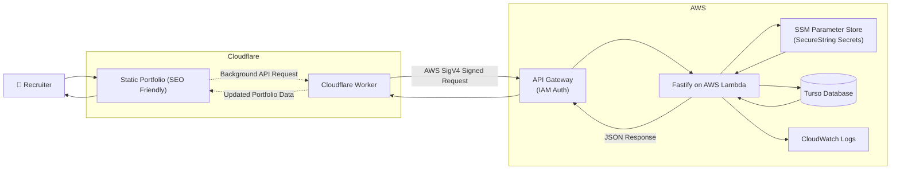
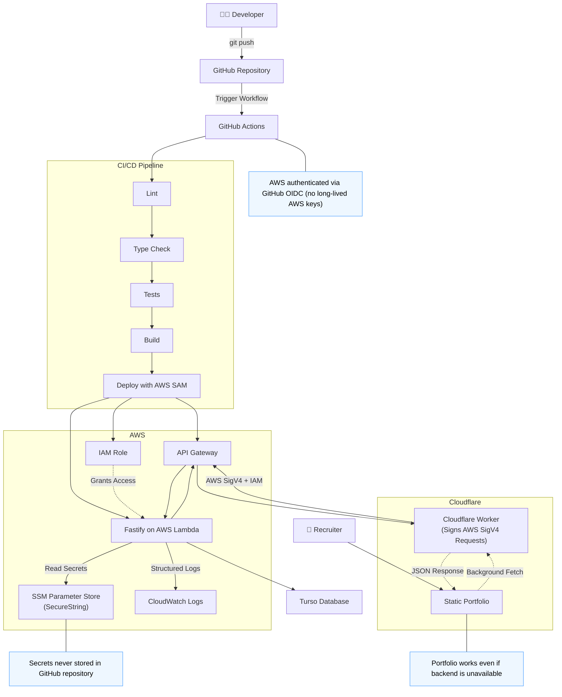

# Portfolio Backend

Backend for Portfolio Website [Het Shukla](https://www.hetshukla.com/). Includes APIs for frontend and to update portfolio data.

Since It is a simple portfolio, architecture is specifically designed to keep cost of hosting and running this always stays 0.

All the decisions and tradeoffs mentioned in the [ADR](portfolio-backend/docs/adr) folder.

### Architecture

#### Diagram

#### Diagram (Development Flow)

